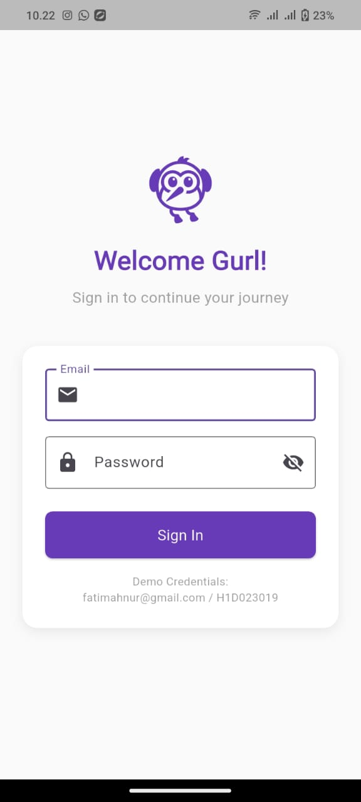
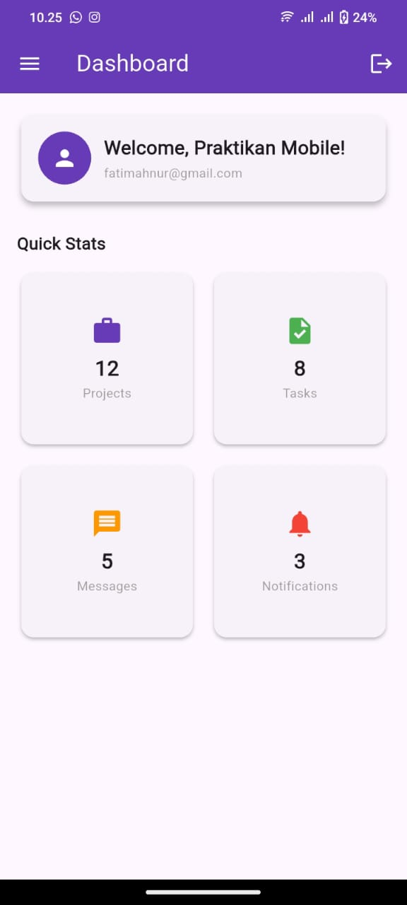
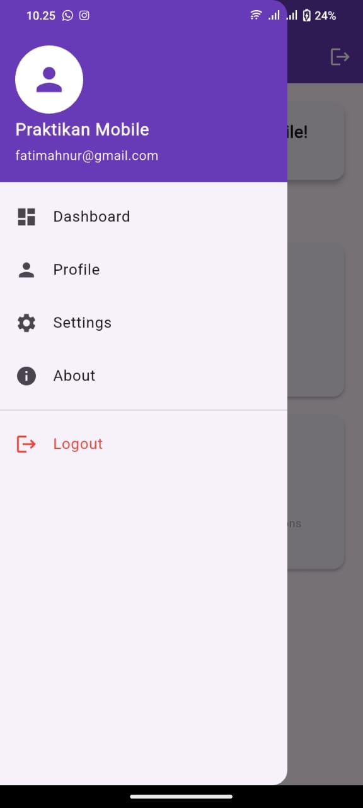
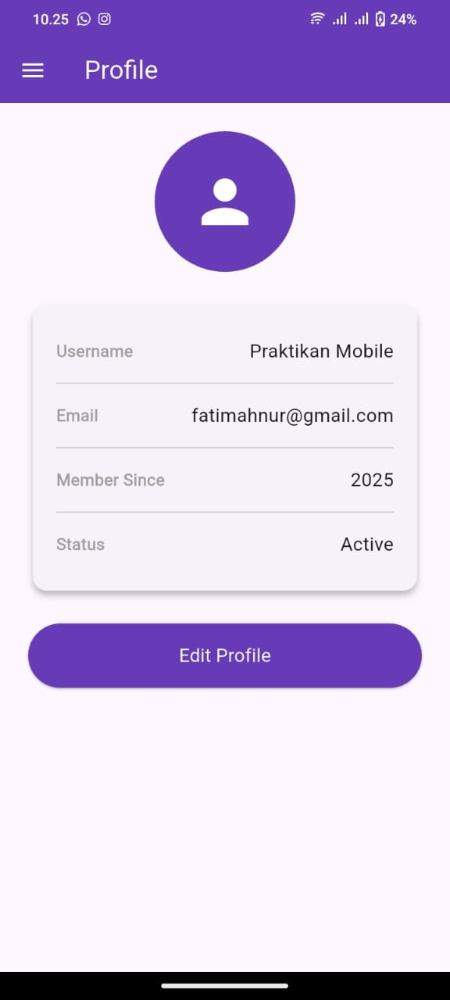
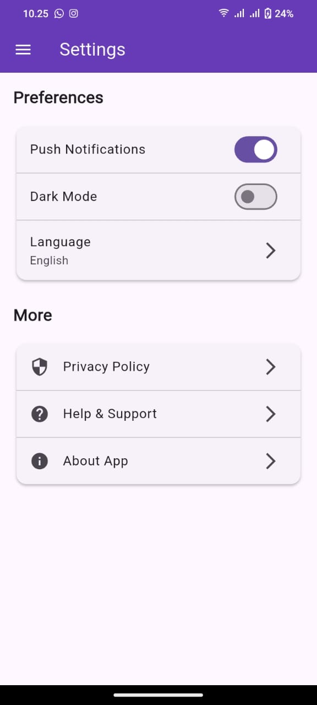
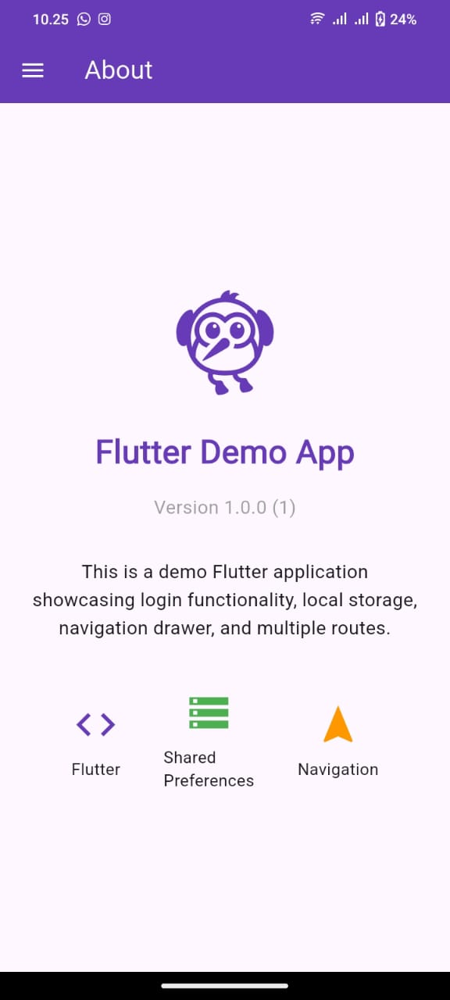

##  Tugas 7 Flutter 

### Nama : Fatimah Nurmawati
### NIM : H1D023019
### Shift: C
  
Aplikasi mengimplementasikan:

- Login dengan Shared Preferences  
- Side Menu (Navigation Drawer)  
- Named Routes  
- Halaman: Home, Profile, Settings, About  
- Penyimpanan data lokal (email, username, status login)

---

## Struktur Project

```
lib/
│
├─ main.dart
│
├─ pages/
│   ├─ login_page.dart
│   ├─ home_page.dart
│   ├─ profile_page.dart
│   ├─ settings_page.dart
│   └─ about_page.dart
│
└─ widgets/
    └─ side_menu.dart
```

---

## Penjelasan Dependencies

Dependencies pada `pubspec.yaml`:

```
dependencies:
  flutter:
    sdk: flutter

  cupertino_icons: ^1.0.8
  shared_preferences: ^2.0.17
  package_info_plus: ^4.2.0
```

#### **1. flutter**
Dependency utama untuk semua widget Material dan fungsi dasar Flutter.

#### **2. cupertino_icons**
Menyediakan ikon bergaya iOS. Merupakan dependency default pada aplikasi Flutter.

#### **3. shared_preferences**
Digunakan untuk menyimpan data lokal sederhana (key–value).  
Pada aplikasi ini digunakan untuk menyimpan:
- email  
- username  
- status login  
dan menghapus data saat logout.

#### **4. package_info_plus**
Digunakan untuk mengambil informasi aplikasi (nama versi, build number) pada halaman About.

---

## Penjelasan Tiap File (Kode Penting)

---

#### **1. main.dart**

Berfungsi sebagai root aplikasi dan mengatur named routes.

```dart
return MaterialApp(
  debugShowCheckedModeBanner: false,
  title: 'Tugas 7',
  initialRoute: '/login',
  routes: {
    '/login': (context) => const LoginPage(),
    '/home': (context) => const HomePage(),
    '/profile': (context) => const ProfilePage(),
    '/settings': (context) => const SettingsPage(),
    '/about': (context) => const AboutPage(),
  },
);
```

---

#### **2. login_page.dart** 
Berfungsi menangani login, validasi input, dan menyimpan data menggunakan SharedPreferences.

##### Menyimpan data user:
```dart
final prefs = await SharedPreferences.getInstance();
await prefs.setString('email', _emailController.text);
await prefs.setString('username', 'Praktikan Mobile');
await prefs.setBool('isLoggedIn', true);
```

##### Navigasi ke Home:
```dart
Navigator.pushReplacementNamed(context, '/home');
```

---

#### **3. side_menu.dart** 
Drawer yang digunakan untuk navigasi ke seluruh halaman dan logout.

##### Menampilkan username & email:
```dart
final username = prefs.getString('username') ?? 'User';
final email = prefs.getString('email') ?? 'user@example.com';
```

##### Navigasi menggunakan named routes:
```dart
Navigator.pushNamed(context, '/profile');
```

##### Logout:
```dart
await prefs.clear();
Navigator.pushNamedAndRemoveUntil(context, '/login', (route) => false);
```

---

#### **4. home_page.dart**  
Menampilkan dashboard serta data user yang diambil dari SharedPreferences.

##### Mengambil data user:
```dart
final prefs = await SharedPreferences.getInstance();
_username = prefs.getString('username') ?? 'User';
_email = prefs.getString('email') ?? '';
```

---

#### **5. profile_page.dart**  
Menampilkan informasi pengguna dalam card dan row.

```dart
_buildInfoRow('Username', _username);
_buildInfoRow('Email', _email);
```

---

#### **6. settings_page.dart**  
Berisi pengaturan sederhana seperti notifikasi dan pemilihan bahasa.

##### Switch Notifikasi:
```dart
SwitchListTile(
  title: const Text('Push Notifications'),
  value: _notifications,
  onChanged: (value) {
    setState(() => _notifications = value);
  },
);
```

##### Dialog Bahasa:
```dart
_showLanguageDialog() {
  showDialog(
    context: context,
    builder: (_) => AlertDialog(
      title: const Text('Select Language'),
      content: Column(
        mainAxisSize: MainAxisSize.min,
        children: [
          ListTile(
            title: const Text('English'),
            onTap: () {
              setState(() => _language = 'English');
              Navigator.pop(context);
            },
          ),
          ListTile(
            title: const Text('Indonesian'),
            onTap: () {
              setState(() => _language = 'Indonesian');
              Navigator.pop(context);
            },
          ),
        ],
      ),
    ),
  );
}
```

---

#### **7. about_page.dart**  
Menampilkan detail aplikasi seperti versi dan logo Flutter.

##### Mengambil versi aplikasi:
```dart
final info = await PackageInfo.fromPlatform();
_version = '${info.version} (${info.buildNumber})';
```

---

### 🛠 Cara Menjalankan

```
flutter pub get
flutter run
```

---

### Screenshot Aplikasi
| Login                     | Dashboard                         | Sidebar                       |
|---------------------------|-----------------------------------|-------------------------------|
| | | |
---
| Profile                       | Setting                        | About                     |
|-------------------------------|--------------------------------|---------------------------|
| | | |
